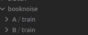
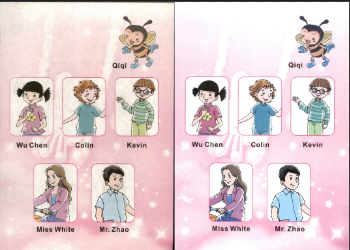

## make data

把数据收集成对的A和B。并放在A和B的train目录下。
```
Create folder /path/to/data with subdirectories A and B. A and B should each have their own subdirectories train, val, test, etc. 
In /path/to/data/A/train, put training images in style A. 
In /path/to/data/B/train, put the corresponding images in style B. 
Repeat same for other data splits (val, test, etc).
```
我的变成数据变成这样子了



然后使用 `combine_A_and_B.py`,合并成一个好的成对数据集。就是把两张图拼接在一块。
python datasets/combine_A_and_B.py --fold_A ./datasets/booknise/A --fold_B ./datasets/booknise/B --fold_AB ./datasets/booknoiseTrain2

最后生成如下图片




因为在运行这个命令的时候发现有写像素不对齐，会有bug，所以加了一段resize操作。

```python
+++ b/datasets/combine_A_and_B.py
@@ -7,7 +7,9 @@ from multiprocessing import Pool
 
 def image_write(path_A, path_B, path_AB):
     im_A = cv2.imread(path_A, 1) # python2: cv2.CV_LOAD_IMAGE_COLOR; python3: cv2.IMREAD_COLOR
+    im_A = cv2.resize(im_A, (2137, 3107))
     im_B = cv2.imread(path_B, 1) # python2: cv2.CV_LOAD_IMAGE_COLOR; python3: cv2.IMREAD_COLOR
+    im_B = cv2.resize(im_B, (2137, 3107))
     im_AB = np.concatenate([im_A, im_B], 1)
     cv2.imwrite(path_AB, im_AB)
 
@@ -43,6 +45,7 @@ for sp in splits:
         os.makedirs(img_fold_AB)
     print('split = %s, number of images = %d' % (sp, num_imgs))
     for n in range(num_imgs):
+        print(n)
         name_A = img_list[n]
         path_A = os.path.join(img_fold_A, name_A)
         if args.use_AB:
@@ -50,6 +53,10 @@ for sp in splits:
         else:
             name_B = name_A
         path_B = os.path.join(img_fold_B, name_B)
+        if not os.path.isfile(path_A):
+            print("A is exist ", path_A)
+        if not os.path.isfile(path_B):
+            print("B is exist " , path_B)
         if os.path.isfile(path_A) and os.path.isfile(path_B):
             name_AB = name_A
             if args.use_AB:
@@ -59,8 +66,11 @@ for sp in splits:
                 pool.apply_async(image_write, args=(path_A, path_B, path_AB))
             else:
                 im_A = cv2.imread(path_A, 1) # python2: cv2.CV_LOAD_IMAGE_COLOR; python3: cv2.IMREAD_COLOR
+                im_A = cv2.resize(im_A, (2137, 3107))
                 im_B = cv2.imread(path_B, 1) # python2: cv2.CV_LOAD_IMAGE_COLOR; python3: cv2.IMREAD_COLOR
+                im_B = cv2.resize(im_B, (2137, 3107))
                 im_AB = np.concatenate([im_A, im_B], 1)
+                print(" write " , n)
                 cv2.imwrite(path_AB, im_AB)
```

## train

修改像素大小，我把它设置成2560，如果GPU内存大一点，还可以设置成更大。

```python
-        parser.add_argument('--batch_size', type=int, default=1, help='input batch size')
-        parser.add_argument('--load_size', type=int, default=286, help='scale images to this size')
-        parser.add_argument('--crop_size', type=int, default=256, help='then crop to this size')
+        parser.add_argument('--batch_size', type=int, default=3, help='input batch size')
+        parser.add_argument('--load_size', type=int, default=2560, help='scale images to this size')
+        parser.add_argument('--crop_size', type=int, default=2560, help='then crop to this size')
```

运行如下命令进行训练

```
python train.py --dataroot ./datasets/booknoiseTrain2 --name booknoiseTrain2 --model pix2pix --direction AtoB
``` 

可以在`checkpoints/booknoiseTrain2`查看结果