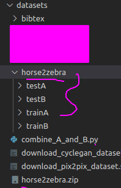

## loss与网络分析
### loss记录
#### 开始时的loss
```python
: 0.542) D_A: 0.347 G_A: 0.376 cycle_A: 2.536 idt_A: 1.072 D_B: 0.260 G_B: 0.229 cycle_B: 2.358 idt_B: 1.187 
(epoch: 1, iters: 200, time: 0.226, data: 0.002) D_A: 0.206 G_A: 0.293 cycle_A: 2.389 idt_A: 1.084 D_B: 0.249 G_B: 0.243 cycle_B: 2.322 idt_B: 1.046 
(epoch: 1, iters: 300, time: 0.224, data: 0.002) D_A: 0.230 G_A: 0.483 cycle_A: 2.119 idt_A: 1.504 D_B: 0.352 G_B: 0.371 cycle_B: 3.149 idt_B: 1.075 
(epoch: 1, iters: 400, time: 0.687, data: 0.002) D_A: 0.307 G_A: 0.570 cycle_A: 2.582 idt_A: 1.448 D_B: 0.341 G_B: 0.233 cycle_B: 3.159 idt_B: 1.168 
(epoch: 1, iters: 500, time: 0.224, data: 0.002) D_A: 0.400 G_A: 0.379 cycle_A: 1.671 idt_A: 1.307 D_B: 0.425 G_B: 0.208 cycle_B: 2.682 idt_B: 0.825 
(epoch: 1, iters: 600, time: 0.227, data: 0.001) D_A: 0.159 G_A: 0.417 cycle_A: 1.226 idt_A: 0.763 D_B: 0.198 G_B: 0.418 cycle_B: 1.631 idt_B: 0.567 
(epoch: 1, iters: 700, time: 0.225, data: 0.002) D_A: 0.233 G_A: 0.537 cycle_A: 2.948 idt_A: 0.831 D_B: 0.377 G_B: 0.318 cycle_B: 1.807 idt_B: 1.169 
(epoch: 1, iters: 800, time: 0.486, data: 0.002) D_A: 0.164 G_A: 0.344 cycle_A: 1.372 idt_A: 0.952 D_B: 0.134 G_B: 0.358 cycle_B: 2.134 idt_B: 0.668 
(epoch: 1, iters: 900, time: 0.223, data: 0.003) D_A: 0.228 G_A: 0.430 cycle_A: 1.370 idt_A: 1.006 D_B: 0.453 G_B: 0.195 cycle_B: 2.120 idt_B: 0.631 
(epoch: 1, iters: 1000, time: 0.223, data: 0.002) D_A: 0.288 G_A: 0.398 cycle_A: 2.501 idt_A: 0.843 D_B: 0.237 G_B: 0.382 cycle_B: 1.834 idt_B: 1.173 

```
#### 结束时的loss

```python
(epoch: 175, iters: 84, time: 0.227, data: 0.002) D_A: 0.237 G_A: 0.403 cycle_A: 0.977 idt_A: 0.259 D_B: 0.256 G_B: 0.239 cycle_B: 0.706 idt_B: 0.348 
(epoch: 175, iters: 184, time: 0.224, data: 0.002) D_A: 0.057 G_A: 0.917 cycle_A: 0.438 idt_A: 0.210 D_B: 0.092 G_B: 0.522 cycle_B: 0.651 idt_B: 0.146 
(epoch: 175, iters: 284, time: 2.570, data: 0.003) D_A: 0.061 G_A: 0.657 cycle_A: 0.345 idt_A: 0.235 D_B: 0.065 G_B: 0.655 cycle_B: 0.549 idt_B: 0.202 
(epoch: 175, iters: 384, time: 0.227, data: 0.002) D_A: 0.054 G_A: 0.901 cycle_A: 0.464 idt_A: 0.279 D_B: 0.097 G_B: 0.448 cycle_B: 0.736 idt_B: 0.254 
(epoch: 175, iters: 484, time: 0.226, data: 0.002) D_A: 0.059 G_A: 0.671 cycle_A: 0.510 idt_A: 0.337 D_B: 0.090 G_B: 0.532 cycle_B: 0.883 idt_B: 0.087 
(epoch: 175, iters: 584, time: 0.228, data: 0.002) D_A: 0.175 G_A: 0.229 cycle_A: 0.818 idt_A: 0.216 D_B: 0.147 G_B: 0.599 cycle_B: 0.780 idt_B: 0.334 
(epoch: 175, iters: 684, time: 0.621, data: 0.002) D_A: 0.166 G_A: 0.647 cycle_A: 0.557 idt_A: 0.290 D_B: 0.364 G_B: 0.088 cycle_B: 0.637 idt_B: 0.276 
(epoch: 175, iters: 784, time: 0.225, data: 0.002) D_A: 0.036 G_A: 1.032 cycle_A: 0.548 idt_A: 0.156 D_B: 0.193 G_B: 0.341 cycle_B: 0.628 idt_B: 0.197 
(epoch: 175, iters: 884, time: 0.226, data: 0.002) D_A: 0.081 G_A: 0.646 cycle_A: 0.775 idt_A: 0.204 D_B: 0.086 G_B: 0.558 cycle_B: 0.714 idt_B: 0.263 
(epoch: 175, iters: 984, time: 0.222, data: 0.002) D_A: 0.065 G_A: 0.758 cycle_A: 0.643 idt_A: 0.266 D_B: 0.188 G_B: 0.588 cycle_B: 0.817 idt_B: 0.222 
(epoch: 175, iters: 1084, time: 0.579, data: 0.003) D_A: 0.200 G_A: 0.635 cycle_A: 0.753 idt_A: 0.251 D_B: 0.135 G_B: 0.602 cycle_B: 0.661 idt_B: 0.235 
(epoch: 175, iters: 1184, time: 0.227, data: 0.002) D_A: 0.079 G_A: 0.514 cycle_A: 0.487 idt_A: 0.289 D_B: 0.123 G_B: 0.527 cycle_B: 0.931 idt_B: 0.155 
(epoch: 175, iters: 1284, time: 0.219, data: 0.002) D_A: 0.031 G_A: 0.867 cycle_A: 0.722 idt_A: 0.225 D_B: 0.177 G_B: 0.643 cycle_B: 0.744 idt_B: 0.288
```

我们看到，G_A和G_B的网络loss,要一直接近1.额D_A和B网络一直接近0。我们分析下网络的内容和原理

### G网络：

G_A 是A生成B的网络   
G_B 是B生成A的网络

```python
        self.fake_B = self.netG_A(self.real_A)  # G_A(A)
        self.rec_A = self.netG_B(self.fake_B)   # G_B(G_A(A))

        self.fake_A = self.netG_B(self.real_B)  # G_B(B)
        self.rec_B = self.netG_A(self.fake_A)   # G_A(G_B(B))
```
G网络的loss
```python
        # GAN loss D_A(G_A(A))
        self.loss_G_A = self.criterionGAN(self.netD_A(self.fake_B), True)
        # GAN loss D_B(G_B(B))
        self.loss_G_B = self.criterionGAN(self.netD_B(self.fake_A), True)
```

### cycle网络：

cycle_A 是A - B - A。
cycle_B 是B - A - B。
```python
        self.loss_cycle_A = self.criterionCycle(self.rec_A, self.real_A) * lambda_A
        # Backward cycle loss || G_A(G_B(B)) - B||
        self.loss_cycle_B = self.criterionCycle(self.rec_B, self.real_B) * lambda_B
```
### idt网络：

idt_A 逆向A网络，就是将B放到 G_A中，本来G_A是用来生成B的。这里逆向应该是，让损失反向减少
idt_B 同上
```python
    # G_A should be identity if real_B is fed: ||G_A(B) - B||
    self.idt_A = self.netG_A(self.real_B)
    self.loss_idt_A = self.criterionIdt(self.idt_A, self.real_B) * lambda_B * lambda_idt

    # G_B should be identity if real_A is fed: ||G_B(A) - A||
    self.idt_B = self.netG_B(self.real_A)
    self.loss_idt_B = self.criterionIdt(self.idt_B, self.real_A) * lambda_A * lambda_idt
```

### 关于rec：
这有个输出的rec图片，刚开始没有看源码，不知道它什么意思。现在我们知道了，是循环输出的图片。用于比较差异。


## 运行
### 数据集

下载

bash ./datasets/download_cyclegan_dataset.sh horse2zebra

然后放到datasets 解压好。


### 训练

```python
CUDA_VISIBLE_DEVICES=3,4 python train.py --dataroot ./datasets/horse2zebra --name horse2zebra_cyclegan --model cycle_gan
```
To see more intermediate results, check out ./checkpoints/maps_cyclegan/web/index.html.

### 测试

```python
 CUDA_VISIBLE_DEVICES=3,4 python test.py --dataroot ./datasets/horse2zebra --name horse2zebra_cyclegan --model cycle_gan
```
The test results will be saved to a html file here: ./results/maps_cyclegan/latest_test/index.html.